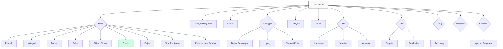
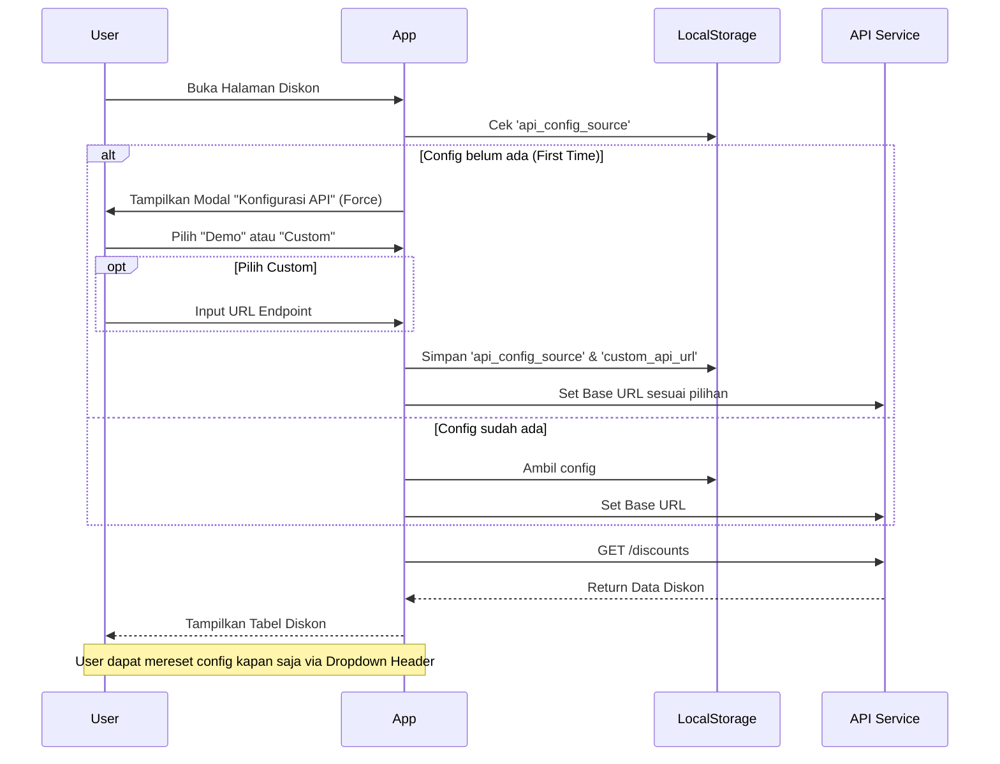

# Nutapos Frontend Challenge

Proyek ini adalah implementasi frontend untuk manajemen diskon dengan fitur konfigurasi API yang fleksibel (Demo vs Custom).

## Teknologi yang Digunakan

Berikut adalah tech stack dan library utama yang digunakan dalam proyek ini:

- **Framework Utama**: [Vue 3](https://vuejs.org/) (Composition API via `<script setup>`)
- **Build Tool**: [Vite](https://vitejs.dev/)
- **Styling**: [Tailwind CSS v4](https://tailwindcss.com/) (Utility-first CSS framework)
- **Routing**: [Vue Router 4](https://router.vuejs.org/)
- **Icons**: [Iconify](https://iconify.design/) (`@iconify/vue`) - Menggunakan Material Symbols.
- **State Management**: Reactivity API (ref, reactive, computed) dari Vue core.

## Sitemap

Struktur navigasi aplikasi digambarkan dalam diagram berikut:
  


*Catatan: Halaman yang aktif dan berfungsi penuh saat ini adalah **Diskon**. Halaman lain menggunakan `GenericView` sebagai placeholder (Coming Soon).*

## Alur Konfigurasi API

Aplikasi ini mendukung dua mode API yang disimpan pengaturannya di `localStorage` browser. Ini memungkinkan user untuk berpindah antara data Demo dan data Custom mereka sendiri.



### Penjelasan Logic API

1.  **LocalStorage Keys**:
    *   `api_config_source`: Bernilai `'default'` (Demo) atau `'custom'`.
    *   `custom_api_url`: Menyimpan URL endpoint CrudCrud milik user jika memilih custom.

2.  **Service (`api.js`)**:
    *   Secara dinamis menentukan `BASE_URL` berdasarkan nilai di LocalStorage setiap kali request dibuat.
    *   Endpoint Demo diambil dari `.env` (`VITE_API_BASE_URL`).

## Cara Menjalankan Project

### Prasyarat
*   Node.js (v18+)
*   NPM

### Setup
1.  Install dependencies:
    ```sh
    npm install
    ```

2.  Jalankan development server:
    ```sh
    npm run dev
    ```

3.  Build untuk production:
    ```sh
    npm run build
    ```

## Struktur File Project

Berikut adalah struktur direktori mendetail dari source code frontend:

```
frontend/
├── public/                 # File statis publik (favicon)
├── src/
│   ├── assets/             # Asset gambar dan media
│   │   ├── favicon/
│   │   └── 404notFound.png
│   ├── components/         # Komponen Vue reusable
│   │   ├── common/         # Komponen umum (Button, Modal, Toast)
│   │   └── items/
│   │       └── discounts/  # Komponen fitur diskon
│   │           ├── ApiSetupModal.vue       # Modal konfigurasi awal API
│   │           ├── DiscountHeader.vue      # Header halaman diskon (Search, Filter, Reset API)
│   │           ├── DiscountTable.vue       # Tabel data diskon
│   │           ├── DiscountModal.vue       # Form tambah/edit diskon
│   │           ├── DiscountEmptyState.vue  # Tampilan saat data kosong
│   │           └── DiscountPagination.vue  # Kontrol pagination
│   ├── composables/        # Logic composition reuse
│   │   └── useToast.js     # Composable untuk notifikasi toast
│   ├── layouts/            # Layout utama aplikasi
│   │   ├── MainLayout.vue  # Wrapper layout (Sidebar + AppBar + Content)
│   │   └── components/     # Komponen layout (Sidebar, AppBar, Footer)
│   ├── router/
│   │   └── index.js        # Definisi route Vue Router
│   ├── services/
│   │   └── api.js          # Konfigurasi Axios dan API wrapper
│   ├── views/              # Halaman-halaman (Page Views)
│   │   ├── GenericView.vue # Halaman 404/Coming Soon dynamic
│   │   └── items/
│   │       └── DiskonView.vue # Controller halaman Diskon utama
│   ├── App.vue             # Root component
│   └── main.js             # Entry point aplikasi
├── index.html              # Template HTML utama
├── tailwind.config.js      # Konfigurasi Tailwind (jika tidak via vite plugin)
├── vite.config.js          # Konfigurasi Vite

## Deployed on Netlify

Project ini sudah dikonfigurasi untuk deployment di [Netlify](https://www.netlify.com/).

### Konfigurasi Tersedia
*   `netlify.toml`: Mengatur build command (`npm run build`) dan publish directory (`dist`).
*   `public/_redirects`: Menangani SPA Routing (Vue Router) agar tidak 404 saat refresh di halaman selain root.

### Cara Deploy
1.  Push code ke GitHub.
2.  Login ke Netlify -> "Add new site" -> "Import an existing project".
3.  Pilih repository GitHub ini.
4.  Netlify akan otomatis mendeteksi setting dari `netlify.toml`.
5.  Klik **Deploy**.
