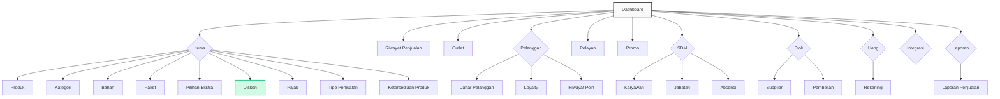

# Nutapos Frontend Challenge

Proyek ini adalah implementasi frontend untuk manajemen diskon dengan fitur konfigurasi API yang fleksibel (Demo vs Custom).

## Teknologi yang Digunakan

Berikut adalah tech stack dan library utama yang digunakan dalam proyek ini:

- **Framework Utama**: [Vue 3](https://vuejs.org/) (Composition API via `<script setup>`)
- **Build Tool**: [Vite](https://vitejs.dev/)
- **Styling**: [Tailwind CSS v4](https://tailwindcss.com/) (Utility-first CSS framework)
- **Routing**: [Vue Router 4](https://router.vuejs.org/)
- **Icons**: [Iconify](https://iconify.design/) (`@iconify/vue`) - Menggunakan Material Symbols.
- **State Management**: Reactivity API (ref, reactive, computed) dari Vue core.

## Sitemap

Struktur navigasi aplikasi digambarkan dalam diagram berikut:
  


*Catatan: Halaman yang aktif dan berfungsi penuh saat ini adalah **Diskon**. Halaman lain menggunakan `GenericView` sebagai placeholder (Coming Soon).*

## Mekanisme Dynamic API URL

Fitur ini memungkinkan pengguna untuk mengubah endpoint API secara dinamis tanpa perlu mengubah variabel environment (`.env`) atau melakukan build ulang aplikasi. Mekanisme ini bekerja dengan memanfaatkan `localStorage` browser sebagai penyimpanan prioritas untuk Base URL API.

### Flowchart Alur Kerja

```mermaid
flowchart TD
    subgraph Initialization [Inisialisasi API]
        Start([Start Request]) --> GetConfig{Cek localStorage<br/>'dynamic_api_url'}
        GetConfig -- Ada --> SetLocal[Gunakan URL dari Storage]
        GetConfig -- Kosong --> SetEnv[Gunakan import.meta.env.VITE_API_BASE_URL]
        
        SetLocal --> Normalize[/Normalisasi URL<br/>(Hapus trailing slash + tambah '/discounts')/]
        SetEnv --> Normalize
    end

    subgraph UserInterface [Interaksi User di UI]
        UserAction([User Buka Settings]) --> InputAPI[Input URL Baru]
        InputAPI --> SaveAction[User Klik Simpan]
        SaveAction --> WriteStorage[localStorage.setItem<br/>'dynamic_api_url']
        WriteStorage --> Reload[Reload Data / Refresh]
    end

    subgraph Execution [Eksekusi Request]
        Normalize --> FetchReq[Fetch HTTP Request]
        FetchReq --> Response{Response OK?}
        Response -- Yes --> ProcessData[Proses Data JSON]
        Response -- No --> ErrorHandler[Throw Error]
    end

    WriteStorage -.-> |Mempengaruhi Request Selanjutnya| GetConfig
```

### Implementasi Teknis

**1. Service Layer (`api.js`)**
Logika pemilihan URL terjadi di sini dengan prioritas: `localStorage` > `.env`.

```javascript
const STORAGE_KEY = 'dynamic_api_url';
const getBaseUrl = () => {
    let url = localStorage.getItem(STORAGE_KEY) || import.meta.env.VITE_API_BASE_URL;
    // Normalisasi URL: ensure ends with '/discounts'
    if (url && !url.endsWith('/discounts')) {
        url = url.replace(/\/$/, '') + '/discounts';
    }
    return url;
};
```

**2. Penyimpanan Browser**
*   **Key**: `dynamic_api_url`
*   **Value**: URL endpoint (contoh: `https://crudcrud.com/api/your-id`)

### Panduan Reset
Jika terjadi kesalahan input URL, user dapat mereset konfigurasi melalui tombol **Reset** pada UI, yang akan menghapus key `dynamic_api_url` dari localStorage dan mengembalikan aplikasi ke URL default dari `.env`.

## Cara Menjalankan Project

### Prasyarat
*   Node.js (v18+)
*   NPM

### Setup
1.  Install dependencies:
    ```sh
    npm install
    ```

2.  Jalankan development server:
    ```sh
    npm run dev
    ```

3.  Build untuk production:
    ```sh
    npm run build
    ```

## Struktur File Project

Berikut adalah struktur direktori mendetail dari source code frontend:

```
frontend/
├── public/                 # File statis publik (favicon)
├── src/
│   ├── assets/             # Asset gambar dan media
│   │   ├── favicon/
│   │   └── 404notFound.png
│   ├── components/         # Komponen Vue reusable
│   │   ├── common/         # Komponen umum (Button, Modal, Toast)
│   │   └── items/
│   │       └── discounts/  # Komponen fitur diskon
│   │           ├── ApiSetupModal.vue       # Modal konfigurasi awal API
│   │           ├── DiscountHeader.vue      # Header halaman diskon (Search, Filter, Reset API)
│   │           ├── DiscountTable.vue       # Tabel data diskon
│   │           ├── DiscountModal.vue       # Form tambah/edit diskon
│   │           ├── DiscountEmptyState.vue  # Tampilan saat data kosong
│   │           └── DiscountPagination.vue  # Kontrol pagination
│   ├── composables/        # Logic composition reuse
│   │   └── useToast.js     # Composable untuk notifikasi toast
│   ├── layouts/            # Layout utama aplikasi
│   │   ├── MainLayout.vue  # Wrapper layout (Sidebar + AppBar + Content)
│   │   └── components/     # Komponen layout (Sidebar, AppBar, Footer)
│   ├── router/
│   │   └── index.js        # Definisi route Vue Router
│   ├── services/
│   │   └── api.js          # Konfigurasi Axios dan API wrapper
│   ├── views/              # Halaman-halaman (Page Views)
│   │   ├── GenericView.vue # Halaman 404/Coming Soon dynamic
│   │   └── items/
│   │       └── DiskonView.vue # Controller halaman Diskon utama
│   ├── App.vue             # Root component
│   └── main.js             # Entry point aplikasi
├── index.html              # Template HTML utama
├── tailwind.config.js      # Konfigurasi Tailwind (jika tidak via vite plugin)
├── vite.config.js          # Konfigurasi Vite

## Deployed on Netlify

Project ini sudah dikonfigurasi untuk deployment di [Netlify](https://www.netlify.com/).

### Konfigurasi Tersedia
*   `netlify.toml`: Mengatur build command (`npm run build`) dan publish directory (`dist`).
*   `public/_redirects`: Menangani SPA Routing (Vue Router) agar tidak 404 saat refresh di halaman selain root.

### Cara Deploy
1.  Push code ke GitHub.
2.  Login ke Netlify -> "Add new site" -> "Import an existing project".
3.  Pilih repository GitHub ini.
4.  **PENTING**: Pada bagian "Site settings" -> "Environment variables", tambahkan variable:
    - Key: `VITE_API_BASE_URL`
    - Value: `https://crudcrud.com/api/YOUR_API_KEY` (Gunakan key dari `.env` atau generate baru)
5.  Klik **Deploy**.
